<div align="center">

# 🛒 Customer Journey & Product Network Intelligence

### Neo4j Graph Analytics × Customer Journey Analysis × Business Intelligence

**Portfolio Project by Ruturaj Mokashi**

<br>


<br>

A graph-powered Business Intelligence project that connects  
**customers, sessions, events, products, orders and reviews**  
to reveal customer journey behaviour, conversion friction, product relationships and commercial opportunities.

</div>

---

## 🌐 Live Application

> **Streamlit deployment link will be added here after deployment.**

---

# 📌 Executive Snapshot

| KPI | Result |
|---|---:|
| **Revenue** | **$4.49M** |
| **Customers** | **20,000** |
| **Sessions** | **120,000** |
| **Orders** | **33,580** |
| **Average Order Value** | **$133.81** |
| **Session Conversion** | **27.98%** |
| **Purchasing Customers** | **16,268** |
| **Repeat Buyers** | **10,045** |
| **Reviews** | **10,780** |

### 🚨 Main Business Signal

> **44.91% of Add-to-Cart sessions fail to progress to Checkout.**

This is the largest proportional loss in the observed purchase journey.

Repeat customers are another major commercial signal:

> **Repeat buyers generate approximately 81.2% of total recorded revenue.**

---

# 🎯 Business Objective

Traditional e-commerce reporting often treats customers, sessions, products and orders as isolated tables.

This project instead models them as a **connected graph**.

That makes it possible to analyse not only:

- what customers purchased,
- how many sessions converted,

but also:

- how customers moved through the journey,
- where conversion friction occurred,
- which products were connected through basket behaviour,
- which products generated interest without purchase,
- which customer groups created the most value,
- and which acquisition combinations delivered both scale and conversion.

The project combines:

**Data Preparation → Neo4j → Cypher → Graph Analytics → Validation → Python BI → Streamlit**

---

# 🏗️ Analytics Architecture

```mermaid
flowchart LR

    A["Raw E-commerce Data"]
    B["Python Data Preparation"]
    C["Validated Clean Data"]
    D["Neo4j Graph Database"]
    E["Cypher Analytics<br/>Q16–Q28"]
    F["Validated CSV Exports"]
    G["Graph Relationships"]
    H["Python BI Visualizations"]
    I["Streamlit BI Application"]
    J["Executive & Portfolio Reporting"]

    A --> B
    B --> C
    C --> D
    D --> E
    E --> F
    E --> G
    F --> H
    F --> I
    G --> I
    H --> I
    I --> J

    <div align="center">

# 🛒 Customer Journey & Product Network Intelligence

### Neo4j Graph Analytics × Customer Journey Analysis × Business Intelligence

**Portfolio Project by Ruturaj Mokashi**

<br>


<br>

A graph-powered Business Intelligence project that connects  
**customers, sessions, events, products, orders and reviews**  
to reveal customer journey behaviour, conversion friction, product relationships and commercial opportunities.

</div>

---

## 🌐 Live Application

> **Streamlit deployment link will be added here after deployment.**

---

# 📌 Executive Snapshot

| KPI | Result |
|---|---:|
| **Revenue** | **$4.49M** |
| **Customers** | **20,000** |
| **Sessions** | **120,000** |
| **Orders** | **33,580** |
| **Average Order Value** | **$133.81** |
| **Session Conversion** | **27.98%** |
| **Purchasing Customers** | **16,268** |
| **Repeat Buyers** | **10,045** |
| **Reviews** | **10,780** |

### 🚨 Main Business Signal

> **44.91% of Add-to-Cart sessions fail to progress to Checkout.**

This is the largest proportional loss in the observed purchase journey.

Repeat customers are another major commercial signal:

> **Repeat buyers generate approximately 81.2% of total recorded revenue.**

---

# 🎯 Business Objective

Traditional e-commerce reporting often treats customers, sessions, products and orders as isolated tables.

This project instead models them as a **connected graph**.

That makes it possible to analyse not only:

- what customers purchased,
- how many sessions converted,

but also:

- how customers moved through the journey,
- where conversion friction occurred,
- which products were connected through basket behaviour,
- which products generated interest without purchase,
- which customer groups created the most value,
- and which acquisition combinations delivered both scale and conversion.

The project combines:

**Data Preparation → Neo4j → Cypher → Graph Analytics → Validation → Python BI → Streamlit**

---

# 🏗️ Analytics Architecture

```mermaid
flowchart LR

    A["Raw E-commerce Data"]
    B["Python Data Preparation"]
    C["Validated Clean Data"]
    D["Neo4j Graph Database"]
    E["Cypher Analytics<br/>Q16–Q28"]
    F["Validated CSV Exports"]
    G["Graph Relationships"]
    H["Python BI Visualizations"]
    I["Streamlit BI Application"]
    J["Executive & Portfolio Reporting"]

    A --> B
    B --> C
    C --> D
    D --> E
    E --> F
    E --> G
    F --> H
    F --> I
    G --> I
    H --> I
    I --> J

🕸️ Neo4j Graph Model
The graph represents the full customer journey from session start to product interaction and purchase.
#chatgpt-mermaid-_r_puh_{font-family:-apple-system-body,ui-sans-serif,-apple-system,system-ui,"Segoe UI",Helvetica,"Apple Color Emoji",Arial,sans-serif,"Segoe UI Emoji","Segoe UI Symbol";font-size:16px;fill:rgb(237, 237, 237);}@keyframes edge-animation-frame{from{stroke-dashoffset:0;}}@keyframes dash{to{stroke-dashoffset:0;}}#chatgpt-mermaid-_r_puh_ .edge-animation-slow{stroke-dasharray:9,5!important;stroke-dashoffset:900;animation:dash 50s linear infinite;stroke-linecap:round;}#chatgpt-mermaid-_r_puh_ .edge-animation-fast{stroke-dasharray:9,5!important;stroke-dashoffset:900;animation:dash 20s linear infinite;stroke-linecap:round;}#chatgpt-mermaid-_r_puh_ .error-icon{fill:rgb(27, 27, 27);}#chatgpt-mermaid-_r_puh_ .error-text{fill:rgb(237, 237, 237);stroke:rgb(237, 237, 237);}#chatgpt-mermaid-_r_puh_ .edge-thickness-normal{stroke-width:1px;}#chatgpt-mermaid-_r_puh_ .edge-thickness-thick{stroke-width:3.5px;}#chatgpt-mermaid-_r_puh_ .edge-pattern-solid{stroke-dasharray:0;}#chatgpt-mermaid-_r_puh_ .edge-thickness-invisible{stroke-width:0;fill:none;}#chatgpt-mermaid-_r_puh_ .edge-pattern-dashed{stroke-dasharray:3;}#chatgpt-mermaid-_r_puh_ .edge-pattern-dotted{stroke-dasharray:2;}#chatgpt-mermaid-_r_puh_ .marker{fill:rgb(175, 175, 175);stroke:rgb(175, 175, 175);}#chatgpt-mermaid-_r_puh_ .marker.cross{stroke:rgb(175, 175, 175);}#chatgpt-mermaid-_r_puh_ svg{font-family:-apple-system-body,ui-sans-serif,-apple-system,system-ui,"Segoe UI",Helvetica,"Apple Color Emoji",Arial,sans-serif,"Segoe UI Emoji","Segoe UI Symbol";font-size:16px;}#chatgpt-mermaid-_r_puh_ p{margin:0;}#chatgpt-mermaid-_r_puh_ .label{font-family:-apple-system-body,ui-sans-serif,-apple-system,system-ui,"Segoe UI",Helvetica,"Apple Color Emoji",Arial,sans-serif,"Segoe UI Emoji","Segoe UI Symbol";color:rgb(237, 237, 237);}#chatgpt-mermaid-_r_puh_ .cluster-label text{fill:rgb(237, 237, 237);}#chatgpt-mermaid-_r_puh_ .cluster-label span{color:rgb(237, 237, 237);}#chatgpt-mermaid-_r_puh_ .cluster-label span p{background-color:transparent;}#chatgpt-mermaid-_r_puh_ .label text,#chatgpt-mermaid-_r_puh_ span{fill:rgb(237, 237, 237);color:rgb(237, 237, 237);}#chatgpt-mermaid-_r_puh_ .node rect,#chatgpt-mermaid-_r_puh_ .node circle,#chatgpt-mermaid-_r_puh_ .node ellipse,#chatgpt-mermaid-_r_puh_ .node polygon,#chatgpt-mermaid-_r_puh_ .node path{fill:rgb(9, 23, 44);stroke:rgb(31, 78, 148);stroke-width:1px;}#chatgpt-mermaid-_r_puh_ .rough-node .label text,#chatgpt-mermaid-_r_puh_ .node .label text,#chatgpt-mermaid-_r_puh_ .image-shape .label,#chatgpt-mermaid-_r_puh_ .icon-shape .label{text-anchor:middle;}#chatgpt-mermaid-_r_puh_ .node .katex path{fill:#000;stroke:#000;stroke-width:1px;}#chatgpt-mermaid-_r_puh_ .rough-node .label,#chatgpt-mermaid-_r_puh_ .node .label,#chatgpt-mermaid-_r_puh_ .image-shape .label,#chatgpt-mermaid-_r_puh_ .icon-shape .label{text-align:center;}#chatgpt-mermaid-_r_puh_ .node.clickable{cursor:pointer;}#chatgpt-mermaid-_r_puh_ .root .anchor path{fill:rgb(175, 175, 175)!important;stroke-width:0;stroke:rgb(175, 175, 175);}#chatgpt-mermaid-_r_puh_ .arrowheadPath{fill:rgb(175, 175, 175);}#chatgpt-mermaid-_r_puh_ .edgePath .path{stroke:rgb(175, 175, 175);stroke-width:1px;}#chatgpt-mermaid-_r_puh_ .flowchart-link{stroke:rgb(175, 175, 175);fill:none;}#chatgpt-mermaid-_r_puh_ .edgeLabel{background-color:rgb(0, 0, 0);text-align:center;}#chatgpt-mermaid-_r_puh_ .edgeLabel p{background-color:rgb(0, 0, 0);}#chatgpt-mermaid-_r_puh_ .edgeLabel rect{opacity:0.5;background-color:rgb(0, 0, 0);fill:rgb(0, 0, 0);}#chatgpt-mermaid-_r_puh_ .labelBkg{background-color:rgba(0, 0, 0, 0.5);}#chatgpt-mermaid-_r_puh_ .cluster rect{fill:rgb(27, 27, 27);stroke:rgba(255, 255, 255, 0.15);stroke-width:1px;}#chatgpt-mermaid-_r_puh_ .cluster text{fill:rgb(237, 237, 237);}#chatgpt-mermaid-_r_puh_ .cluster span{color:rgb(237, 237, 237);}#chatgpt-mermaid-_r_puh_ div.mermaidTooltip{position:absolute;text-align:center;max-width:200px;padding:2px;font-family:-apple-system-body,ui-sans-serif,-apple-system,system-ui,"Segoe UI",Helvetica,"Apple Color Emoji",Arial,sans-serif,"Segoe UI Emoji","Segoe UI Symbol";font-size:12px;background:rgb(27, 27, 27);border:1px solid rgba(255, 255, 255, 0.15);border-radius:2px;pointer-events:none;z-index:100;}#chatgpt-mermaid-_r_puh_ .flowchartTitleText{text-anchor:middle;font-size:18px;fill:rgb(237, 237, 237);}#chatgpt-mermaid-_r_puh_ rect.text{fill:none;stroke-width:0;}#chatgpt-mermaid-_r_puh_ .icon-shape,#chatgpt-mermaid-_r_puh_ .image-shape{background-color:rgb(0, 0, 0);text-align:center;}#chatgpt-mermaid-_r_puh_ .icon-shape p,#chatgpt-mermaid-_r_puh_ .image-shape p{background-color:rgb(0, 0, 0);padding:2px;}#chatgpt-mermaid-_r_puh_ .icon-shape .label rect,#chatgpt-mermaid-_r_puh_ .image-shape .label rect{opacity:0.5;background-color:rgb(0, 0, 0);fill:rgb(0, 0, 0);}#chatgpt-mermaid-_r_puh_ .label-icon{display:inline-block;height:1em;overflow:visible;vertical-align:-0.125em;}#chatgpt-mermaid-_r_puh_ .node .label-icon path{fill:currentColor;stroke:revert;stroke-width:revert;}#chatgpt-mermaid-_r_puh_ .node .neo-node{stroke:rgb(31, 78, 148);}#chatgpt-mermaid-_r_puh_ [data-look="neo"].node rect,#chatgpt-mermaid-_r_puh_ [data-look="neo"].cluster rect,#chatgpt-mermaid-_r_puh_ [data-look="neo"].node polygon{stroke:url(#chatgpt-mermaid-_r_puh_-gradient);filter:drop-shadow( 1px 2px 2px rgba(185,185,185,1));}#chatgpt-mermaid-_r_puh_ [data-look="neo"].swimlane.cluster rect{filter:none;}#chatgpt-mermaid-_r_puh_ [data-look="neo"].node path{stroke:url(#chatgpt-mermaid-_r_puh_-gradient);stroke-width:1px;}#chatgpt-mermaid-_r_puh_ [data-look="neo"].node .outer-path{filter:drop-shadow( 1px 2px 2px rgba(185,185,185,1));}#chatgpt-mermaid-_r_puh_ [data-look="neo"].node .neo-line path{stroke:rgb(31, 78, 148);filter:none;}#chatgpt-mermaid-_r_puh_ [data-look="neo"].node circle{stroke:url(#chatgpt-mermaid-_r_puh_-gradient);filter:drop-shadow( 1px 2px 2px rgba(185,185,185,1));}#chatgpt-mermaid-_r_puh_ [data-look="neo"].node circle .state-start{fill:#000000;}#chatgpt-mermaid-_r_puh_ [data-look="neo"].icon-shape .icon{fill:url(#chatgpt-mermaid-_r_puh_-gradient);filter:drop-shadow( 1px 2px 2px rgba(185,185,185,1));}#chatgpt-mermaid-_r_puh_ [data-look="neo"].icon-shape .icon-neo path{stroke:url(#chatgpt-mermaid-_r_puh_-gradient);filter:drop-shadow( 1px 2px 2px rgba(185,185,185,1));}#chatgpt-mermaid-_r_puh_ .node text{font-size:14px;font-weight:600;letter-spacing:normal;fill:rgb(153, 206, 255);}#chatgpt-mermaid-_r_puh_ .edgeLabels text{font-size:13px;font-weight:600;letter-spacing:-0.08px;fill:rgb(153, 206, 255);}#chatgpt-mermaid-_r_puh_ .node tspan[font-weight="normal"],#chatgpt-mermaid-_r_puh_ .edgeLabels tspan[font-weight="normal"]{font-weight:600;}#chatgpt-mermaid-_r_puh_ .edgeLabel .label rect{opacity:1;rx:13px;ry:13px;fill:rgb(0, 14, 26);stroke:rgb(26, 62, 95);stroke-width:1px;}#chatgpt-mermaid-_r_puh_ .node rect,#chatgpt-mermaid-_r_puh_ .node circle,#chatgpt-mermaid-_r_puh_ .node ellipse,#chatgpt-mermaid-_r_puh_ .node polygon,#chatgpt-mermaid-_r_puh_ .node path{fill:rgb(0, 40, 77);stroke:rgba(255, 255, 255, 0.1);stroke-width:1px;}#chatgpt-mermaid-_r_puh_ .node rect{rx:16px;ry:16px;}#chatgpt-mermaid-_r_puh_ .node.mermaid-decision .label-container{fill:rgb(0, 14, 26);stroke:rgb(26, 62, 95);stroke-dasharray:2,2;}#chatgpt-mermaid-_r_puh_ .edgePaths .flowchart-link{stroke:rgb(175, 175, 175);stroke-width:1px;stroke-linecap:round;stroke-linejoin:round;}#chatgpt-mermaid-_r_puh_ .marker{fill:rgb(175, 175, 175);stroke:rgb(175, 175, 175);}#chatgpt-mermaid-_r_puh_ :root{--mermaid-font-family:-apple-system-body,ui-sans-serif,-apple-system,system-ui,"Segoe UI",Helvetica,"Apple Color Emoji",Arial,sans-serif,"Segoe UI Emoji","Segoe UI Symbol";}CustomerSessionEventEventProductOrderReviewSTARTEDHAS_EVENTNEXTINTERACTED_WITHPLACEDCONVERTED_TOGENERATEDCONTAINSHAS_REVIEWABOUT


Graph Scale
Entity	Count
Customers	20,000
Products	1,197
Sessions	120,000
Events	760,958
Orders	33,580
Reviews	10,780


Relationships
Relationship	Count
STARTED	120,000
HAS_EVENT	760,958
NEXT	640,958
INTERACTED_WITH	682,469
PLACED	33,580
CONVERTED_TO	33,580
GENERATED	33,580
CONTAINS	59,053
HAS_REVIEW	10,780
ABOUT	10,780


📊 Executive Performance
<p align="center">
  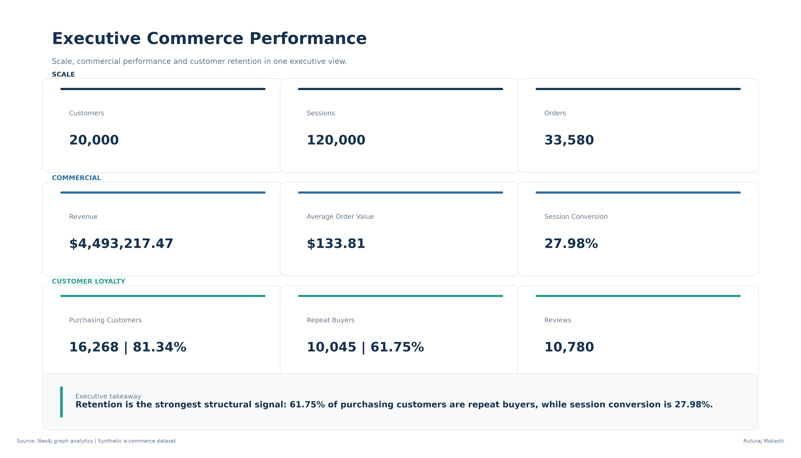
</p>

The executive analytical layer consolidates the key commercial measures generated from the Neo4j graph.
🔄 Customer Journey Intelligence
Customer Conversion Funnel
<p align="center">
  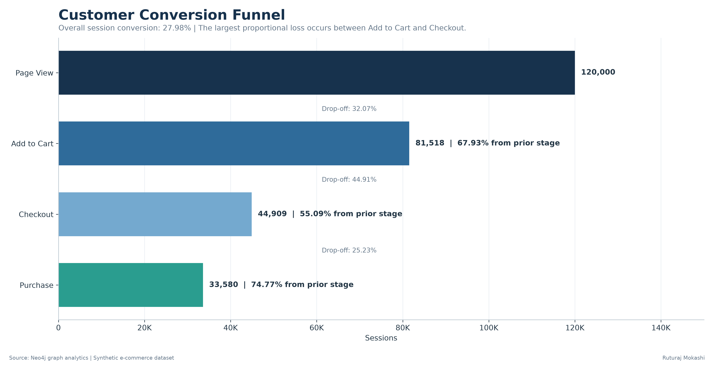
</p>

Journey Stage	Sessions
Page View	120,000
Add to Cart	81,518
Checkout	44,909
Purchase	33,580


Stage Conversion
Transition	Conversion
Page View → Add to Cart	67.93%
Add to Cart → Checkout	55.09%
Checkout → Purchase	74.77%
Overall Session Conversion	27.98%


Key Finding
The largest journey loss occurs between:
Add to Cart → Checkout
with:
36,609 lost sessions / 44.91% stage loss
This makes checkout initiation the clearest conversion-optimization opportunity.
Journey Behaviour
<table>
<tr>
<td width="50%" valign="top">

Funnel Abandonment
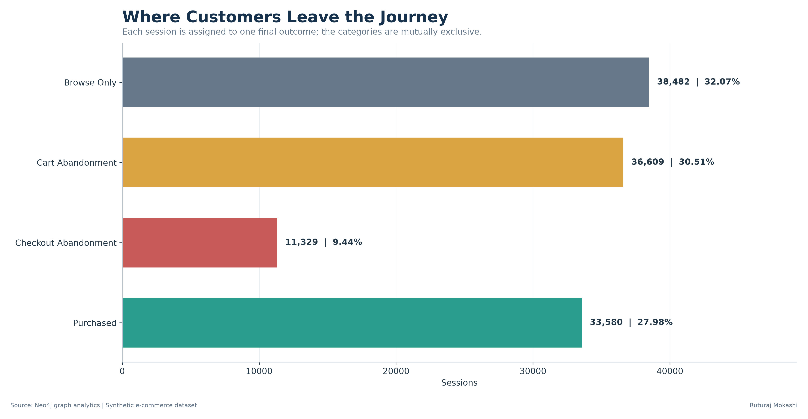

</td>

<td width="50%" valign="top">

Conversion Journey Length
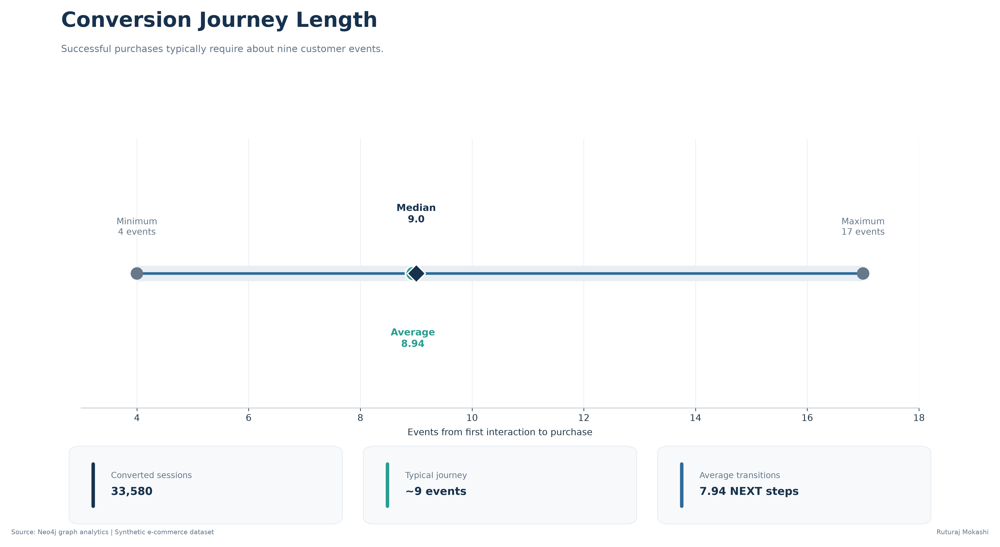

</td>
</tr>

<tr>
<td width="50%" valign="top">

Time to Purchase
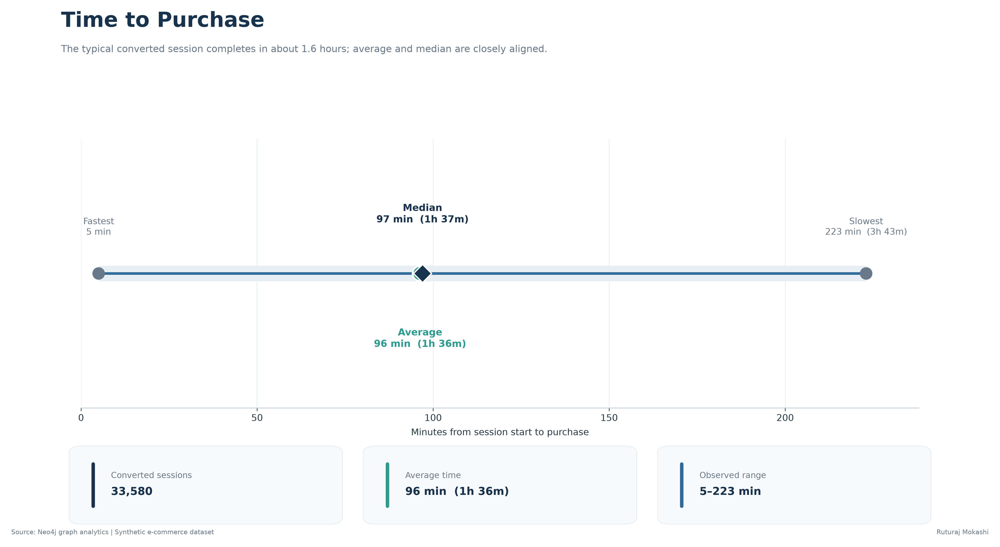

</td>

<td width="50%" valign="top">

Common Purchase Journeys
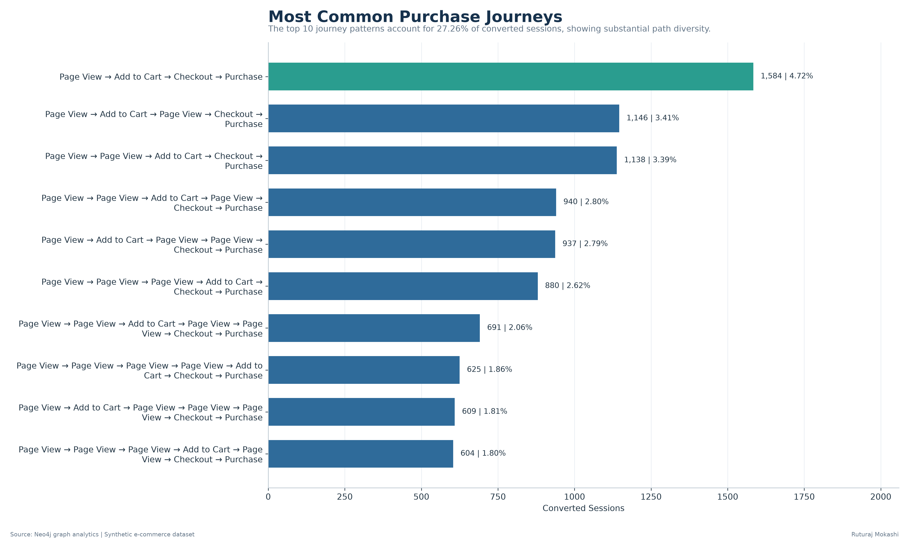

</td>
</tr>
</table>

Journey Insights
38,482 sessions remain at Browse Only.
36,609 sessions abandon after Add to Cart.
11,329 sessions reach Checkout but do not purchase.
33,580 sessions successfully convert.
Converted sessions contain approximately 9 events on average, while average purchase time is approximately 96 minutes.
The path analysis also shows that customer behaviour is not perfectly linear.
Customers frequently continue browsing after adding products to their cart.
🛍️ Product Intelligence
<table>
<tr>

<td width="50%" valign="top">

Viewed but Not Purchased
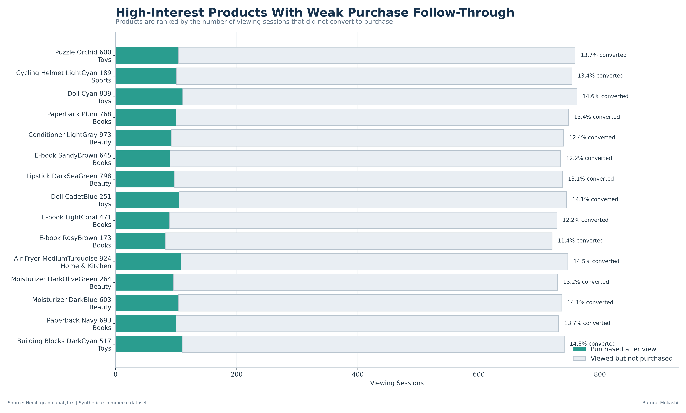

</td>

<td width="50%" valign="top">

Product Affinity
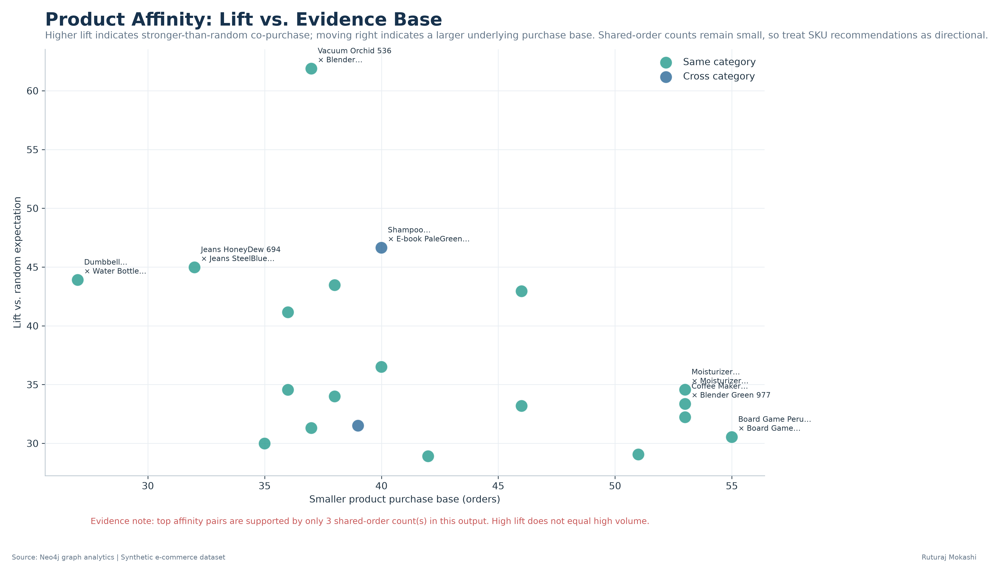

</td>

</tr>

<tr>

<td width="50%" valign="top">

Cross-Sell Opportunities
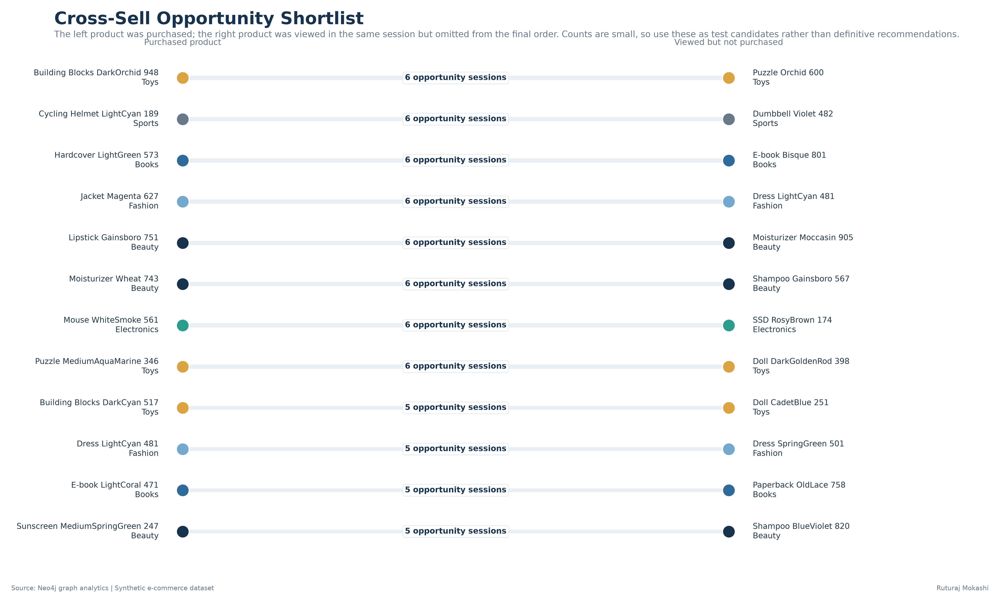

</td>

<td width="50%" valign="top">

Category Co-Purchase Matrix
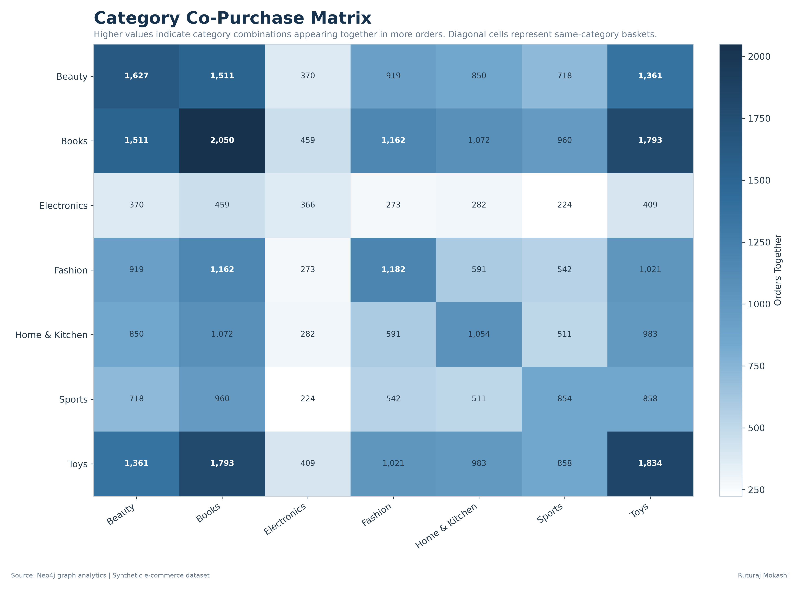

</td>

</tr>
</table>

Product Analysis
The product layer answers several different commercial questions.
Viewed but Not Purchased
Identifies products receiving strong customer attention without equivalent purchase follow-through.
This is useful for investigating:
pricing · availability · product detail quality · reviews · merchandising
Product Affinity
Measures whether products occur together more frequently than expected.
Affinity is interpreted using:
Lift + Support + Confidence + Shared Orders
A high lift value alone is not treated as sufficient evidence.
Cross-Sell Analysis
Finds situations where a customer:
1. purchased one product,
2. viewed another product during the same converted session,
3. but did not include that second product in the order.
These relationships become candidates for recommendation or merchandising experiments.
🔗 Product Network Intelligence
<p align="center">
  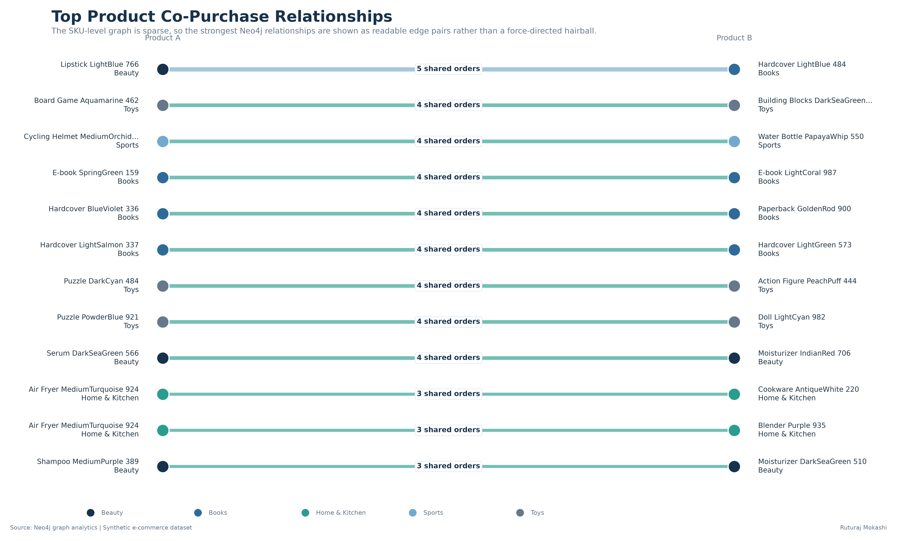
</p>

Neo4j allows product relationships to be analysed as a network rather than only as rows in a table.
Instead of asking only:
Which products sold the most?

the graph model also enables:
Which products are connected through shared purchasing behaviour?

The Streamlit application includes an additional interactive Graph Explorer for investigating selected co-purchase relationships.
Important Interpretation
SKU-level co-purchase evidence in this dataset is relatively sparse.
Therefore graph relationships are treated as:
candidate commercial signals

rather than automatically as production recommendation rules.
👥 Customer Value Intelligence
<p align="center">
  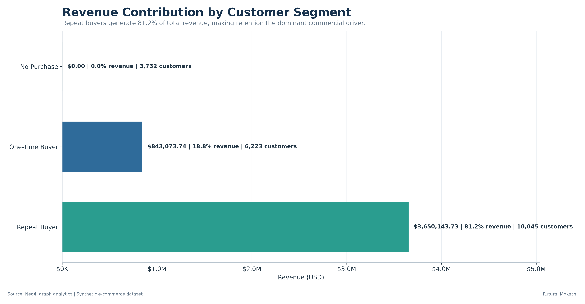
</p>

Customers are divided into three value segments.
Customer Segment	Customers	Orders	Revenue
No Purchase	3,732	0	$0
One-Time Buyer	6,223	6,223	$843,073.74
Repeat Buyer	10,045	27,357	$3,650,143.73


Commercial Finding
Repeat customers generate approximately:
<div align="center">

81.2% of Revenue
</div>

This highlights the commercial importance of:
CRM · loyalty · personalization · replenishment · win-back activity
alongside acquisition.
📱 Device & Acquisition Intelligence
<p align="center">
  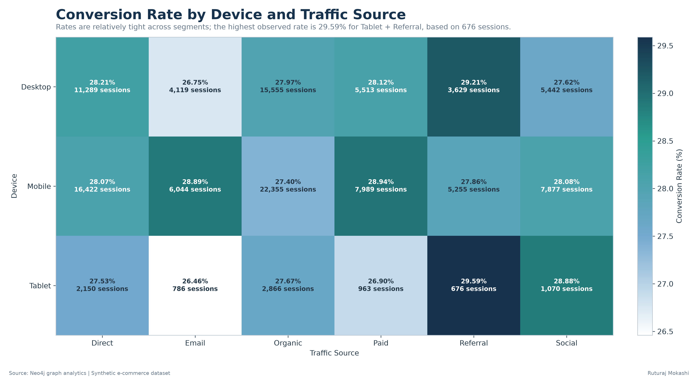
</p>

The highest and lowest observed device/source conversion rates differ by only approximately:
3.13 percentage points
This means channel decisions should not be based on conversion rate alone.
A stronger decision framework is:
<div align="center">

Conversion Rate × Traffic Volume × Revenue
</div>

For example, Mobile + Organic contributes very high session volume even though it does not have the highest observed conversion rate.
🧠 Analytical Query Layer
The portfolio analysis is generated through Neo4j Cypher queries.
Query	Business Analysis
Q16	Customer Conversion Funnel
Q17	Funnel Abandonment
Q18	Conversion Journey Length
Q19	Time to Purchase
Q20	Common Purchase Journeys
Q21	Viewed but Not Purchased
Q22	Product Co-Purchase Network
Q23	Product Affinity
Q24	Cross-Sell Opportunities
Q25	Category Co-Purchase
Q26	Customer Value Segments
Q27	Device × Traffic Source
Q28	Executive KPI Summary


Cypher source files are stored in:
neo4j/queries/

✅ Analytical Validation
The reporting layer includes validation before results are presented.
Validation checks include:
- unique entity identifiers,
- relationship join integrity,
- purchase-event reconciliation,
- customer-count reconciliation,
- session-count reconciliation,
- order-count reconciliation,
- revenue reconciliation,
- funnel-stage ordering,
- percentage-range validation.

Cross-Query Reconciliation

Q16 Sessions      = Q28 Sessions

Q16 Purchases     = Q28 Orders

Q26 Customers     = Q28 Customers

Q26 Orders        = Q28 Orders

Q26 Revenue       = Q28 Revenue

Q27 Sessions      = Q28 Sessions

The Streamlit application stops rather than silently displaying inconsistent core metrics if these reconciliation checks fail.
🖥️ Streamlit BI Application
The project contains a presentation-focused Streamlit application with six analytical areas.
01  Executive Overview

02  Customer Journey

03  Product Intelligence

04  Customer & Channels

05  Graph Explorer

06  Methodology

Application Features
- Executive KPI dashboard
- Customer conversion funnel
- Funnel-loss diagnosis
- Customer abandonment analysis
- Conversion journey length
- Time-to-purchase analysis
- Customer journey sequence analysis
- Product missed-opportunity analysis
- Product affinity
- Cross-sell opportunity analysis
- Category co-purchase matrix
- Customer value segmentation
- Device/source performance
- Interactive product relationship network
- Neo4j graph methodology
- Cross-query validation
🛠️ Technology Stack
Layer	Technology
Graph Database	Neo4j
Graph Query Language	Cypher
Data Processing	Python
Data Manipulation	Pandas
Visualization	Matplotlib
Network Analysis	NetworkX
BI Application	Streamlit
Version Control	Git / GitHub


📁 Project Structure
Neo4j_PowerBI_Ecommerce/
│
├── exports/
│   │
│   ├── charts/
│   │   ├── 16_customer_funnel.png
│   │   ├── 17_funnel_abandonment.png
│   │   ├── 18_conversion_journey_length.png
│   │   ├── 19_conversion_time.png
│   │   ├── 20_common_journey_paths.png
│   │   ├── 21_viewed_not_purchased.png
│   │   ├── 22_product_copurchase_network.png
│   │   ├── 23_product_affinity.png
│   │   ├── 24_cross_sell_opportunities.png
│   │   ├── 25_category_copurchase_heatmap.png
│   │   ├── 26_customer_value_segments.png
│   │   ├── 27_device_source_conversion.png
│   │   └── 28_executive_kpis.png
│   │
│   └── analytical CSV exports
│
├── neo4j/
│   ├── graph/
│   └── queries/
│
├── scripts/
│   ├── 01_prepare_data.py
│   └── 02_export_and_visualize_neo4j.py
│
├── streamlit_app.py
├── requirements.txt
├── .gitignore
└── README.md

Raw/local datasets are deliberately excluded from GitHub.
▶️ Run Locally
Clone the repository:
git clone <repository-url>

Move into the repository:
cd Neo4j_PowerBI_Ecommerce

Install dependencies:
pip install -r requirements.txt

Run Streamlit:
python -m streamlit run streamlit_app.py

Then open:
http://localhost:8501

☁️ Deployment
The application is designed for deployment through Streamlit Community Cloud.
The deployed dashboard reads the validated analytical CSV files and visualization assets committed to the repository.
This means the public application does not require direct access to the local Neo4j database.
💡 Business Questions Answered
This project demonstrates how graph analytics and Business Intelligence can work together to answer questions such as:
Where does the customer journey lose the most users?

How long does conversion take?

What event sequences lead to successful purchase?

Which products generate interest without sufficient purchase follow-through?

Which products are commonly purchased together?

Which relationships show unusually high affinity?

Which products present cross-sell opportunities?

Which categories frequently occur together?

Which customer segments generate the most commercial value?

Which acquisition combinations provide both conversion efficiency and scale?

🚀 Portfolio Value
This project demonstrates an end-to-end analytics workflow:
<div align="center">

Data Engineering
↓
Graph Modelling
↓
Cypher Analytics
↓
Validation
↓
Business Intelligence
↓
Interactive Reporting
↓
Deployment
</div>

The objective is not simply to generate charts.
The project demonstrates how technical analytics can be translated into:
business questions → validated evidence → commercial interpretation → decision support
⚠️ Data Disclaimer
This portfolio uses a synthetic e-commerce dataset.
The analytical findings therefore demonstrate methodology, graph analytics, BI design and decision-support techniques rather than describing a real company's commercial performance.
<div align="center">

Ruturaj Mokashi
Data Analytics · Business Intelligence · Graph Analytics

   
</div>
```

Now press Ctrl + S in VS Code.