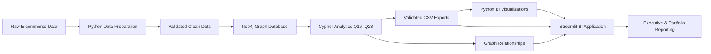
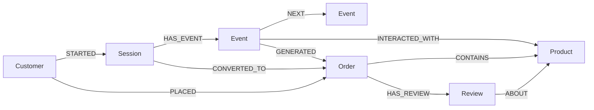

<div align="center">

# Customer Journey & Product Network Intelligence

### Neo4j Graph Analytics · Customer Journey Analysis · Business Intelligence

**Portfolio Project by Ruturaj Mokashi**

<br>


<br>

A graph-powered e-commerce intelligence project connecting **customers, sessions, events, products, orders, and reviews** to reveal conversion friction, customer value, product relationships, and cross-sell opportunities.

</div>

---

## Live Application

> **Streamlit Community Cloud deployment is in progress.**  
> Add the public application URL here after deployment.

---

## Executive Snapshot

<table>
<tr>
<td align="center"><b>$4.49M</b><br><sub>Revenue</sub></td>
<td align="center"><b>120K</b><br><sub>Sessions</sub></td>
<td align="center"><b>33,580</b><br><sub>Orders</sub></td>
<td align="center"><b>27.98%</b><br><sub>Conversion</sub></td>
<td align="center"><b>$133.81</b><br><sub>Average Order Value</sub></td>
<td align="center"><b>61.75%</b><br><sub>Repeat Buyers of Buyers</sub></td>
</tr>
</table>

### Key commercial signals

| Signal | Finding | Business meaning |
|---|---:|---|
| **Largest funnel loss** | **44.91%** | Add to Cart → Checkout is the biggest journey leakage point |
| **Repeat-buyer revenue share** | **81.2%** | Retention is a major commercial value driver |
| **Purchasing customers** | **81.34%** | 16,268 of 20,000 customers purchased |
| **Channel conversion spread** | **3.13 pp** | Channel decisions should balance rate, scale, and revenue |

---

## Business Problem

Traditional e-commerce reporting often treats customers, sessions, products, and orders as isolated tables. That works for standard aggregation, but it becomes less natural when the business question depends on **relationships and sequences**.

This project uses Neo4j to model the customer journey as a connected graph and answer questions such as:

- Where do customers abandon the conversion journey?
- How many interactions occur before purchase?
- How long does conversion take?
- Which event sequences commonly lead to purchase?
- Which products receive strong interest but weak purchase follow-through?
- Which products and categories are bought together?
- Which product relationships show meaningful affinity?
- Which cross-sell opportunities appear inside converted sessions?
- Which customer segments generate the most value?
- Which device/source combinations combine conversion efficiency with scale?

The final output is a presentation-ready Streamlit BI application backed by validated Neo4j analytical exports.

---

## Analytics Architecture



**Data Preparation → Graph Modelling → Cypher Analytics → Validation → Visualization → Streamlit BI**

---

## Neo4j Graph Model

The graph represents the customer journey from session start through product interaction, purchase, and review.



### Graph scale

| Entity | Count |
|---|---:|
| Customers | 20,000 |
| Products | 1,197 |
| Sessions | 120,000 |
| Events | 760,958 |
| Orders | 33,580 |
| Reviews | 10,780 |

| Relationship | Count |
|---|---:|
| `STARTED` | 120,000 |
| `HAS_EVENT` | 760,958 |
| `NEXT` | 640,958 |
| `INTERACTED_WITH` | 682,469 |
| `PLACED` | 33,580 |
| `CONVERTED_TO` | 33,580 |
| `GENERATED` | 33,580 |
| `CONTAINS` | 59,053 |
| `HAS_REVIEW` | 10,780 |
| `ABOUT` | 10,780 |

---

## Executive Performance

<p align="center">
  
</p>

The executive layer reconciles the major commercial measures produced by the graph analytics workflow.

---

## Customer Journey Intelligence

### Conversion Funnel

<p align="center">
  
</p>

| Journey stage | Sessions | Stage result |
|---|---:|---:|
| Page View | 120,000 | 100.00% of sessions |
| Add to Cart | 81,518 | 67.93% from Page View |
| Checkout | 44,909 | 55.09% from Add to Cart |
| Purchase | 33,580 | 74.77% from Checkout |

**Overall session conversion: 27.98%**

The most important funnel finding is the **44.91% loss from Add to Cart to Checkout**, equal to **36,609 sessions**.

### Journey behaviour gallery

<table>
<tr>
<td width="50%" valign="top">
<b>Funnel Abandonment</b><br><br>

</td>
<td width="50%" valign="top">
<b>Conversion Journey Length</b><br><br>

</td>
</tr>
<tr>
<td width="50%" valign="top">
<b>Time to Purchase</b><br><br>

</td>
<td width="50%" valign="top">
<b>Common Purchase Journeys</b><br><br>

</td>
</tr>
</table>

### Journey findings

- **38,482** sessions remain at Browse Only.
- **36,609** sessions abandon after Add to Cart.
- **11,329** sessions reach Checkout but do not purchase.
- **33,580** sessions convert.
- Converted sessions contain about **9 events on average**.
- Average time to purchase is about **96 minutes**.
- Successful journeys are not always linear; customers often continue browsing after adding products to cart.

---

## Product Intelligence

<table>
<tr>
<td width="50%" valign="top">
<b>Viewed but Not Purchased</b><br><br>

</td>
<td width="50%" valign="top">
<b>Product Affinity</b><br><br>

</td>
</tr>
<tr>
<td width="50%" valign="top">
<b>Cross-Sell Opportunities</b><br><br>

</td>
<td width="50%" valign="top">
<b>Category Co-Purchase Matrix</b><br><br>

</td>
</tr>
</table>

### What this layer measures

**Viewed but Not Purchased** identifies high missed-volume products: strong viewing interest without equivalent purchase follow-through. It is a missed-opportunity measure, not automatically a low-conversion-rate ranking.

**Product Affinity** combines lift with support, confidence, and shared-order evidence. High lift on a tiny evidence base is treated cautiously.

**Cross-Sell Opportunities** connect a purchased product with another product viewed in the same converted session but omitted from the final order.

**Category Co-Purchase** reveals frequent basket combinations at category level. Raw frequency is interpreted separately from normalized affinity.

---

## Product Network Intelligence

<p align="center">
  
</p>

Neo4j turns basket relationships into a network rather than a flat list.

Instead of asking only:

> **Which products sell the most?**

we can also ask:

> **Which products are connected through shared purchasing behaviour?**

The Streamlit application adds an interactive Graph Explorer for selected co-purchase relationships.

### Important interpretation

SKU-level co-purchase evidence in this synthetic dataset is relatively sparse. For that reason, product-network relationships are treated as **candidate recommendation signals**, not as production recommendation rules.

---

## Customer Value Intelligence

<p align="center">
  
</p>

| Customer segment | Customers | Orders | Revenue |
|---|---:|---:|---:|
| No Purchase | 3,732 | 0 | $0 |
| One-Time Buyer | 6,223 | 6,223 | $843,073.74 |
| Repeat Buyer | 10,045 | 27,357 | $3,650,143.73 |

### Commercial finding

> **Repeat buyers generate approximately 81.2% of total recorded revenue.**

This makes retention, CRM, loyalty, replenishment, personalization, and win-back activity strategically important alongside acquisition.

---

## Device & Acquisition Intelligence

<p align="center">
  
</p>

The observed conversion-rate spread across device/source combinations is only approximately **3.13 percentage points**.

That means channel performance should not be evaluated on conversion rate alone.

> **Conversion Rate + Traffic Volume + Revenue**

For example, **Mobile + Organic** is the largest traffic combination in the analysis, with **22,355 sessions**, while its conversion rate remains close to the overall channel range.

---

## Streamlit BI Application

The application is organized into six report sections:

| Section | Purpose |
|---|---|
| **01 Executive Overview** | Commercial KPIs, funnel priority, executive story |
| **02 Customer Journey** | Funnel, abandonment, journey length, conversion time, paths |
| **03 Product Intelligence** | Missed opportunity, affinity, cross-sell, category basket |
| **04 Customer & Channels** | Customer value and acquisition performance |
| **05 Graph Explorer** | Interactive product co-purchase relationships |
| **06 Methodology** | Graph model, dataset scale, validation, executive reconciliation |

### Application features

- Dark presentation-focused BI interface
- Executive KPI dashboard
- Native conversion funnel
- Funnel-loss diagnosis
- Customer journey sequence analysis
- Product opportunity analysis
- Product affinity and cross-sell analysis
- Category basket intelligence
- Customer value segmentation
- Device/source conversion analysis
- Interactive graph explorer with static fallback
- Methodology and graph-model documentation
- Cross-query validation before rendering core metrics

---

## Analytical Query Layer

| Query | Analysis |
|---|---|
| Q16 | Customer Conversion Funnel |
| Q17 | Funnel Abandonment |
| Q18 | Conversion Journey Length |
| Q19 | Time to Purchase |
| Q20 | Common Purchase Journeys |
| Q21 | Viewed but Not Purchased |
| Q22 | Product Co-Purchase Network |
| Q23 | Product Affinity |
| Q24 | Cross-Sell Opportunities |
| Q25 | Category Co-Purchase |
| Q26 | Customer Value Segments |
| Q27 | Device × Traffic Source |
| Q28 | Executive KPI Summary |

Cypher files are stored in [`neo4j/queries`](neo4j/queries).

---

## Analytical Validation

The reporting layer validates core analytical outputs before presentation.

### Validation controls

- Unique entity identifiers
- Important join/orphan checks
- Purchase-event reconciliation
- Customer-count reconciliation
- Session-count reconciliation
- Order-count reconciliation
- Revenue reconciliation
- Funnel stage-order validation
- Percentage range validation

### Cross-query reconciliation

```text
Q16 Sessions    = Q28 Sessions
Q16 Purchases   = Q28 Orders
Q26 Customers   = Q28 Customers
Q26 Orders      = Q28 Orders
Q26 Revenue     = Q28 Revenue
Q27 Sessions    = Q28 Sessions
```

If these core checks fail, the Streamlit application stops instead of silently presenting inconsistent headline metrics.

---

## Technology Stack

| Layer | Technology |
|---|---|
| Graph Database | Neo4j |
| Graph Query Language | Cypher |
| Data Processing | Python |
| Data Manipulation | Pandas |
| Visualization | Matplotlib |
| Network Analysis | NetworkX |
| BI Application | Streamlit |
| Version Control | Git / GitHub |

---

## Repository Structure

```text
Neo4j_PowerBI_Ecommerce/
│
├── .streamlit/
│   └── config.toml
│
├── exports/
│   ├── charts/
│   │   ├── 16_customer_funnel.png
│   │   ├── 17_funnel_abandonment.png
│   │   ├── 18_conversion_journey_length.png
│   │   ├── 19_conversion_time.png
│   │   ├── 20_common_journey_paths.png
│   │   ├── 21_viewed_not_purchased.png
│   │   ├── 22_product_copurchase_network.png
│   │   ├── 23_product_affinity.png
│   │   ├── 24_cross_sell_opportunities.png
│   │   ├── 25_category_copurchase_heatmap.png
│   │   ├── 26_customer_value_segments.png
│   │   ├── 27_device_source_conversion.png
│   │   └── 28_executive_kpis.png
│   └── analytical CSV exports
│
├── neo4j/
│   ├── graph/
│   └── queries/
│
├── scripts/
│   ├── 01_prepare_data.py
│   └── 02_export_and_visualize_neo4j.py
│
├── .gitignore
├── README.md
├── requirements.txt
└── streamlit_app.py
```

Raw/local source datasets are deliberately excluded from version control.

---

## Run Locally

```bash
git clone <repository-url>
cd Neo4j-PowerBI-Ecommerce
pip install -r requirements.txt
python -m streamlit run streamlit_app.py
```

Then open:

```text
http://localhost:8501
```

---

## Deployment

The dashboard is designed for **Streamlit Community Cloud**.

The deployed application reads the validated analytical CSV exports and chart assets committed to the repository, so the public dashboard does **not** require direct access to the local Neo4j instance.

After deployment, replace the placeholder near the top of this README with the public application URL.

---

## Portfolio Value

This project demonstrates an end-to-end analytics workflow:

```text
Data Preparation
      ↓
Graph Modelling
      ↓
Cypher Analytics
      ↓
Validation
      ↓
Business Intelligence
      ↓
Interactive Reporting
      ↓
Deployment
```

The objective is not simply to generate charts. It demonstrates how technical analytics can be translated into:

> **Business Question → Validated Evidence → Commercial Interpretation → Decision Support**

---

## Data Disclaimer

This portfolio uses a **synthetic e-commerce dataset**.

The analytical findings demonstrate graph analytics, BI design, validation, and decision-support methodology rather than the performance of a real commercial organization.

---

<div align="center">

### Ruturaj Mokashi

**Data Analytics · Business Intelligence · Graph Analytics**

<br>


</div>
